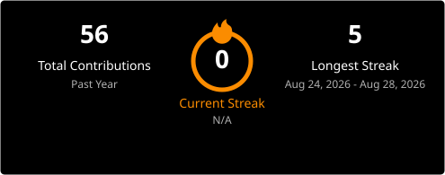

<h1 align="center">Hi there, I'm Ghani 👋</h1>

  

  
  

---

### 🚀 About Me

- 🎯 Fullstack Developer at **PT Kreator Solusi Informasi**, building enterprise Supply Chain Management (SCM) systems
- 💻 Core stack: **PHP (Laravel 8, CodeIgniter 3)**, **JavaScript**, **React.js**, **SQL Server**
- 🎓 Graduated with honors (GPA 3.78/4.00) in Informatics Engineering Education, Universitas Negeri Jakarta
- 🌱 Currently exploring **Domain-Driven Design**, **microservices**, and **Python**
- 📫 Reach me at **ghanirsyd@gmail.com**
- 🌐 Portfolio: [ghani-portfolio-two.vercel.app](https://ghani-portfolio-two.vercel.app/)

---

### 🛠️ Tech Stack

  

  
  
  
  

---

### 📊 GitHub Stats

  
  

  

> Semua card di atas di-generate otomatis oleh GitHub Actions (bukan lagi minta ke server publik), jadi jauh lebih jarang broken.

---

### 🐍 Contribution Snake

  

---

### 🏆 Trophies

  

> ⚠️ Trophy masih pakai server publik (belum ada versi Actions-nya) — kalau nanti sering putus juga, bisa aku bantu ganti ke widget lain.

---

### 🌐 Connect with Me

  
  
  
  

---

  

